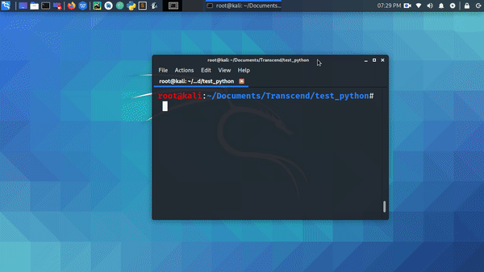
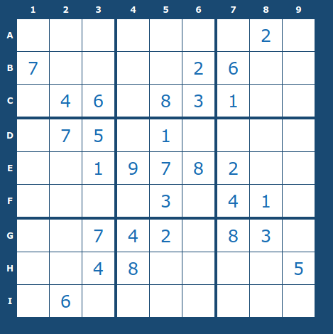

# sudoku-solver

### Modules Used : numpy, pyautogui, pyfiglet
      
      For Windows : pip install numpy
                    pip install pyautogui
                    pip install pyfiglet
            
       
      For Linux   : pip3 install numpy
                    pip3 install pyautogui
                    pip3 install pyfiglet

## OUTPUT: 

   
   
   

### These pictures are from a sudoku solver website :

   1) Before Solving

   

   1) After Solving

   
